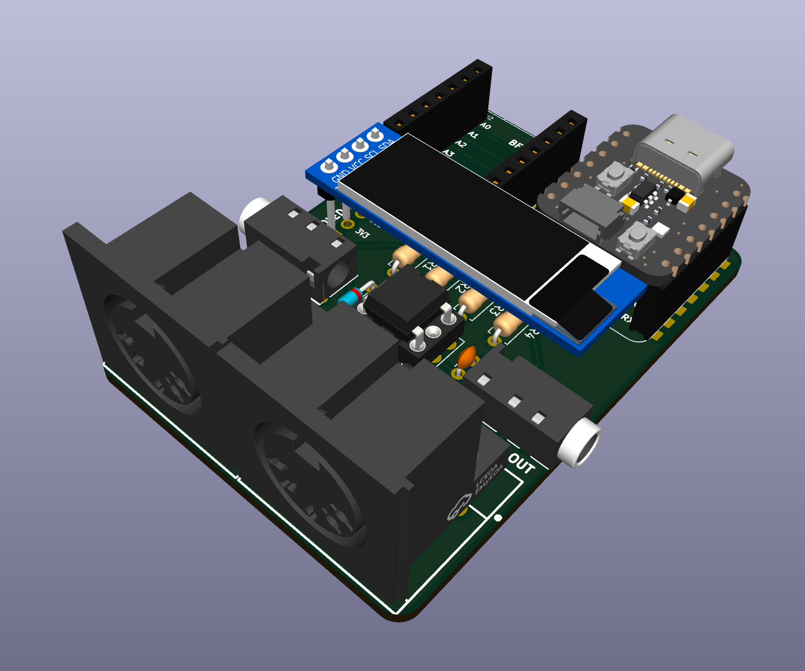

# qtpy_midibff

QTPy MIDI BFF — a small MIDI interface board for QTPy / Xiao class boards (RP2040 or compatible).
The board breaks out the host MCU's hardware UART to standard MIDI IN and MIDI OUT jacks (TRS or 5-pin DIN).



## Hardware

The PCB is meant for easy assembly using only through-hole components. 
It is essentialy a QTPy "doubler" with a standard MIDI In and MIDI Out circuit, 
with a 4-pin I2C header for a standard OLED display (usually 128x32 SSD1306).

## Assembling

_Coming soon._


## Arduino sketches

Requires [arduino-pico](https://arduino-pico.readthedocs.io/en/latest/install.html) board core.

Set **Tools > USB Stack: Adafruit TinyUSB** before uploading any sketch.

Libraries needed (Arduino Library Manager):
- [Adafruit TinyUSB](https://github.com/adafruit/Adafruit_TinyUSB_Arduino)
- [MIDI Library](https://github.com/FortySevenEffects/arduino_midi_library)
- [Adafruit SSD1306](https://github.com/adafruit/Adafruit_SSD1306) + [Adafruit GFX Library](https://github.com/adafruit/Adafruit-GFX-Library) _(OLED sketches only)_

### `midi_interface` — USB-MIDI ↔ UART-MIDI bridge

[`arduino/midi_interface/`](arduino/midi_interface/)

Forwards all MIDI between USB and UART in both directions. Includes scaffolding to filter or
transform messages — uncomment the examples or add your own:

- Drop realtime messages (clock, active sensing, etc.)
- Transpose notes on a channel
- Remap channels

```
arduino-cli compile \
  --fqbn rp2040:rp2040:adafruit_qtpy:usbstack=tinyusb \
  arduino/midi_interface
```

SysEx messages up to 127 bytes are forwarded. See the source for notes on larger SysEx.

### `midi_interface_oled` — bridge with OLED display

[`arduino/midi_interface_oled/`](arduino/midi_interface_oled/)

Same bridge as `midi_interface`, with a 128x32 SSD1306 I2C OLED that displays each incoming
message. Realtime messages (clock, active sensing) are forwarded but not shown, to avoid flicker.

```
arduino-cli compile \
  --fqbn rp2040:rp2040:adafruit_qtpy:usbstack=tinyusb \
  arduino/midi_interface_oled
```

### `midi_interface_simple` — simplified bridge for learners

[`arduino/midi_interface_simple/`](arduino/midi_interface_simple/)

Same USB-MIDI ↔ UART-MIDI bridge with the same filter/transform scaffolding, but with SysEx
handling and advanced notes removed. A good starting point if you just want to read and modify
the forwarding logic without the extra complexity.

```
arduino-cli compile \
  --fqbn rp2040:rp2040:adafruit_qtpy:usbstack=tinyusb \
  arduino/midi_interface_simple
```

## CircuitPython sketches

Requires CircuitPython 9+ firmware on the board.

Libraries needed:
- [tmidi](https://github.com/todbot/CircuitPython_TMIDI) — copy `tmidi.py` to `/lib/` on your device or install with `circup tmidi`
- [adafruit_ssd1306](https://github.com/adafruit/Adafruit_CircuitPython_SSD1306) — install with `circup install adafruit_ssd1306` _(OLED sketches only)_

### `midi_interface` — USB-MIDI ↔ UART-MIDI bridge

[`circuitpython/midi_interface/`](circuitpython/midi_interface/)

Forwards all MIDI between USB and UART in both directions. Same filter/transform scaffolding
as the Arduino version — uncomment the examples or add your own:

- Drop realtime messages (clock, active sensing, etc.)
- Transpose notes on a channel
- Remap channels

SysEx messages up to 127 bytes are forwarded. Increase the `sysex_buf_*` bytearray sizes in
the source to raise the limit.

Copy `code.py` to the root of your device, or copy the whole `midi_interface/` folder and
rename `code.py` to suit.

### `midi_interface_oled` — bridge with OLED display

[`circuitpython/midi_interface_oled/`](circuitpython/midi_interface_oled/)

Same bridge as `midi_interface`, with a 128x32 SSD1306 I2C OLED that displays each incoming
message. Realtime messages are forwarded but not shown, to avoid flicker. The sketch continues
as a plain MIDI bridge if no display is connected.

Copy `code.py` to the root of your device, or copy the whole `midi_interface_oled/` folder and
rename `code.py` to suit.

## Hardware

Schematic and PCB in `schematics/midi_bff/` (KiCad).
